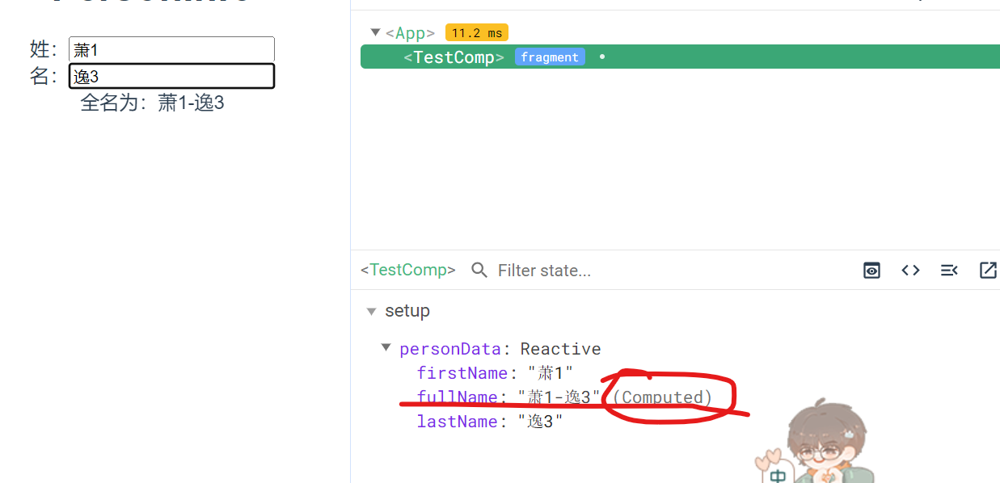
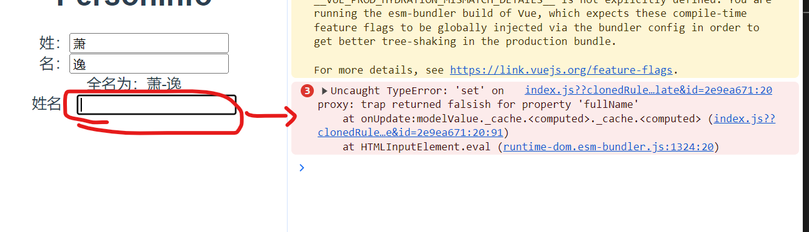
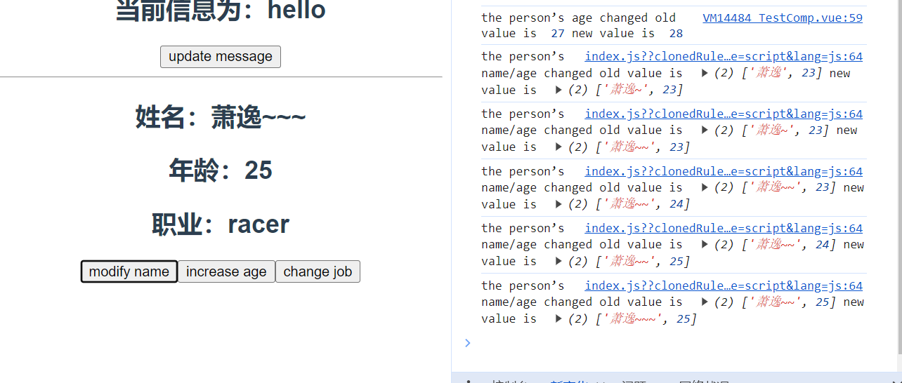
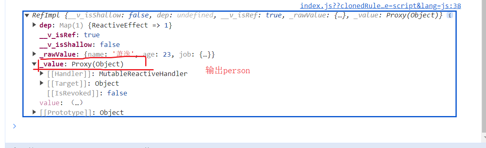
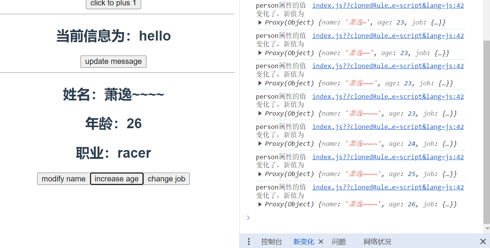
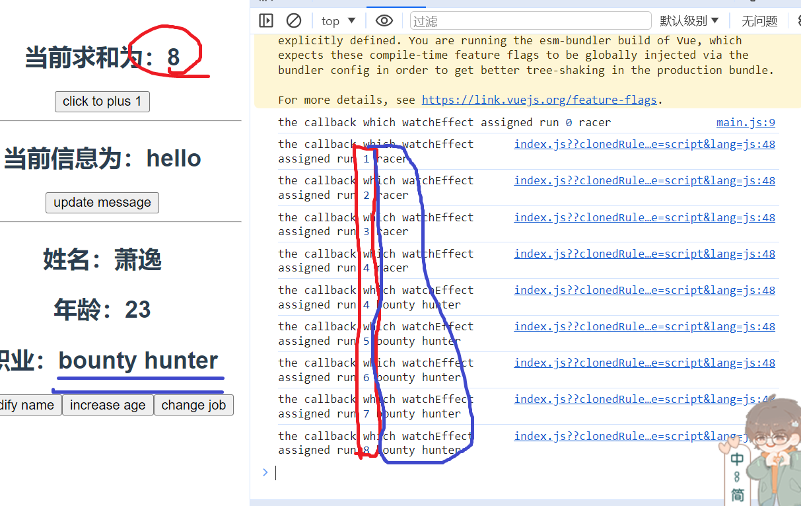
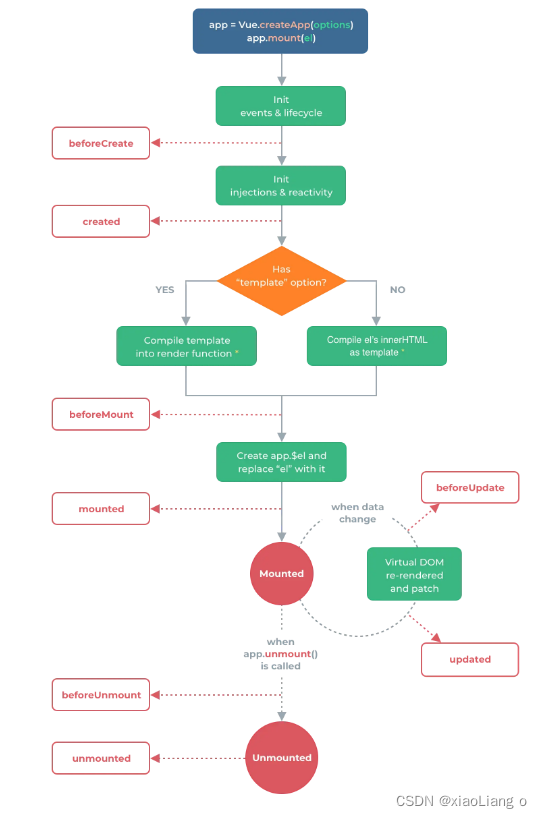
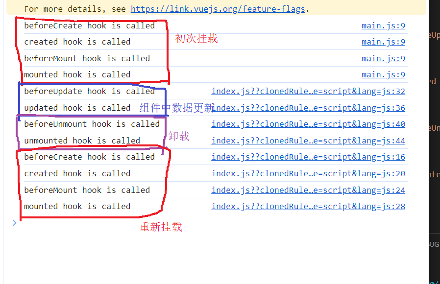
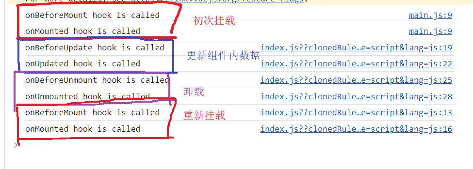

## Vue3快速上手
* 1. Vue3简介
    * 2020年9月18日，Vue.js发布3.0版本，代号：One Piece(海贼王)
    * 耗时两年多、2600+次提交、30+哥RFC、600+次PR、99位贡献者
    * github上的tags地址：https://github.com/vuejs/vue-next/releases/tag/v3.0.0
* 2. Vue3带来了什么
    * 2.1 性能的提升
        * 打包大小减少41%
        * 初次渲染快55%，更新渲染快133%
        * 内存减少54%
        ...
    * 2.2 源码的升级
        * 使用Proxy代替defineProperty实现响应式
        * 重写虚拟DOM的实现和Tree-Shakong
        ...
    * 2.3 拥抱TypeScript
        * Vue3 可以更好地支持TypeScript
        ...
    * 2.4 新的特性
        * 1. Composition API(组合API)
            * setup配置
            * ref与reactive
            * watch与watchEffect
            * provide与inject
            ....
        * 2. 新的内置组件
            * Fragment
            * Teleport
            * Suspense
        * 3. 其他改变
            * 新的生命周期钩子
            * data选项应始终被声明为一个函数，不管是否为组件，data选项都应被声明为函数形式
            * 移除keyCode支持作为v-on的修饰符
            ...

## 第一章、创建Vue3.0
* 1.1 使用vue-cli创建
    * 官方文档：https://cli.vuejs.org/zh/guide/creating-a-project.html#vue-create
    * 1. 需要查看vue-cli的版本，要确保vue-cli的版本在4.5.0以上，我的是5.0.8，若vue-cli版本在4.5.0以下，则安装升级vue-cli版本，```npm i -g @vue-cli```，会将最新版本的vue-cli版本安装好，并覆盖掉旧版本；
    * 2. 创建一个vue脚手架项目，```vue create vue3_test```
    * 3. 创建好项目脚手架后，就可以在vue3_test目录下启动，
        * ```
            cd vue3_test
            npm run serve
          ```
* 1.2 使用vite创建
    * 官方文档：https://v3.cn.vuejs.org/guide/installation.html#vite
    * vite官网：https://vitejs.cn
    * 什么是vite？----新一代前端构建工具
    * 优势如下：
        * 1. 开发环境中，无需打包操作，可快速的冷启动
        * 2. 轻量快速地热重载(HMR)
        * 3. 真正的按需编译，不再等待整个应用编译完成
    * 传统构建与vite构建对比图
        * 图找不到，在尚硅谷138课看吧
        * 1. 创建工程，npm init vite-app <project-name>
        * 2. 进入工程目录，cd <project-name>
        * 3. 安装依赖，npm install
        * 4. 运行，npm run dev
## 第二章、常用Composition API
* 官方文档：https://v3.cn.vuejs.org/guide/composition-api-introduction.html
* 2.1 拉开序幕的setup
    * 1. 理解：Vue3.0中一个新的配置项，值为一个函数
    * 2. setup是所有Composition API(组合API)**表演的舞台**
    * 3. 组件中所用到的：数据、方法等，均要配置在setup中
    * 4. setup函数的两种返回值：
        * (1). **若返回一个对象，则对象中的属性、方法，在模板中均可以直接使用(重点关注)**
        * (2). 若返回一个渲染函数：则可以自定义渲染内容
    * 5. 注意点：
        * (1). 尽量不要与Vue2.x的配置混用
            * Vue2.x配置(data、methods、computed...)中可以访问到setup中的属性、方法。
            * 但在setup中不能访问到Vue2.x配置(data、methods、computed...)
            * 如果有重名setup优先
        * (2). setup不能是一个async函数，因为返回值不再是return的对象，而是promise，模板看不到return对象中的属性
* 2.2 ref函数
    * 1. 作用：定义一个响应式的数据，用于数据是基本类型
    * 2. 语法：const xxx=ref(initValue)
        * 创建一个包含响应式数据的**引用对象**(全称：引用实现的实例对象，reference对象，简称ref对象)
        * JS中操作数据：xxx.value
        * 模板中读取数据: 不需要.value，直接：``<div>{{xxx}}</div>``
    * 备注：
        * 接收的数据可以是：基本类型、也可以是对象类型。
        * 基本类型的数据：响应式依然是靠 Object.defineProperty()的 get与 set完成的。
        * 对象类型的数据：内部**求助**了Vue3.0中的一个新函数—— reactive函数。
    * 
    * 
* 2.3 reactive函数
    * 1. 作用：定义一个**对象类型**的响应式数据(基本类型别用它，用ref函数)
    * 2. 语法：const 代理对象-proxy=reactive(源对象-Object)，接收一个对象或数组，返回一个代理器对象(Proxy实例对象)，将普通对象转为Proxy实例对象的目的就是为了把数据变成响应式数据，且转为Proxy对象后，修改里面任何一个属性，vue3都可以监测到，并更新页面。
    * 3. reactive函数定义的响应式数据是**深层次的**
    * 4. 内部基于ES6的Proxy实现，通过代理对象(Proxy实例对象)操作源对象(Object)内部数据进行操作，且这些操作是可以被Vue所捕获到的，也就是数据劫持
        * 
        * 
        * ```
            // 数据
            let job=reactive({
                type:'frontend engineer',
                salary:'10k',
            })
            // 方法
            function changeInfo(){
                job.type='backend enginner'
                job.salary='13k'
            }
            // 返回对象
            return {
                job,
                changeInfo
            }
          ```
            * 
        * ```
            let hobby=['Osborn','Sariel','Evan']
            function changeInfo(){
                hobby[0]='study'
            }
            return {hobby,changeInfo}
          ```
            * 
* 2.4 Vue2.0中的响应式原理
    * 2.4.1 Vue2.x的响应式
        * 1. 实现原理：
            * 对象类型：通过Object.defineProperty()对属性的读取、修改进行拦截(数据劫持)
            * 数组类型：通过重写更新数组的一系列方法来实现拦截(对数组的变更方法进行了包裹)
                * ```
                    Object.defineProperty(data,'count',{
                        get(){},
                        set(){}
                    })
                  ```
        * 2. 存在问题：
            * 新增属性、删除属性，界面不会更新
            * 直接通过下标修改数组，界面不会自动更新
            * 
    * 2.4.2 Vue3.0的响应式
        * 实现原理：
            * 1. 通过Proxy(代理)对象：拦截对象中任意属性的变化，包括：属性值的读写、属性的添加、属性的删除等。
                * 
                * 
                * 
                * 
            * 2. 通过Reflect(反射)对象：对源对象的属性进行增删改查的操作
            * 3. MDN文档中描述的Proxy与Reflect：
                * Proxy：https://developer.mozilla.org/zh-CN/docs/Web/JavaScript/Reference/Global_Objects/Proxy
                * Reflect：https://developer.mozilla.org/zh-CN/docs/Web/JavaScript/Reference/Global_Objects/Reflect
                * ```
                    new Proxy(data,{
                        // 拦截读取属性值
                        get(target,propName){
                            return Reflect.get(target.propName)
                        }
                        // 拦截修改属性值或添加新属性
                        set(target,propName,value){
                            return Reflect.set(target,propName,value)
                        }
                        // 拦截删除属性
                        deleteProperty (target, propName) {
                            return Reflect.deleteProperty(target, propName)
                        }
                    })
                  ```
* 2.5 reactive对比ref
    * 2.5.1 从定义数据角度对比：
        * 1. ref用来定义：**基本类型数据**
        * 2. reactive用来定义：**对象或数组类型数据**
        * 3. 备注：ref也可以用来定义对象/数组类型数据，他内部会自动通过reactive转为代理对象(Proxy实例对象)
    * 2.5.2 从原理角度对比：
        * 1. ref通过Object.defineProperty()的get与set来实现响应式(数据劫持)
        * 2. reactive通过使用Proxy来实现响应式(数据劫持)，并通过Reflect操作**源对象**内部的数据
    * 2.5.3 从使用角度对比：
        * 1. ref定义的数据：操作数据需要.value，读取数据时模板中直接读取不需要.value
        * 2. reactive定义的数据：操作数据与读取数据，均不需要.value
* 2.6 setup的两个注意点
    * 1. setup执行的时机
        * 在beforeCreate钩子之前执行一次，this指向undefined
    * 2. setup的参数
        * props：值为对象，包含：组件外部传递过来，且组件内部声明接收了的属性，传了几个属性，就要在子组件声明接收几个，否则报警告。
            * 
        * context：上下文对象
            * attrs：值为对象，包含组件外部传递过来，但没有在props配置中声明的属性，相当于this.$attrs，它来兜底，子组件的props配置中没有接收的，在这里偷偷地存着。
            * slots：收到的插槽内容，相当于this.$slots。值得注意的是，vue3中具名插槽的命名方式有所改动，需要用v-slot:slotName的方式命名。
                * ```
                    <template v-slot:cv>
                        <span>谷江山</span>
                    </template>
                  ```
                * 
            * emit：分发自定义事件的函数，相当于this.$emit。
                * ```
                    App
                    <TestComp @hello="showHelloMsg" msg="hello" name="yosh"/>
                    ...
                    setup(){
                        function showHelloMsg(value){
                            alert(`Hello, you have triggered hello event, I got the parameter ${value}!!`)
                        }
                        return {showHelloMsg}
                    }

                    TestComp
                    <button @click="test">try to trigger hello event in TestComp component</button>
                    ...
                    emits:['hello'],
                    setup(){
                        function test(){
                            context.emit('hello',111)
                        }
                        return {test}
                    }
                  ```
                * 
* 2.7 计算属性与监视
    * 2.7.1 computed函数
        * 与Vue2.x中computed配置功能一致，也分简写和完整写法，当计算出来的属性也可能被读取和修改的话，就用完整写法，否则只是删掉初始化数据都会报错
        * 写法：
            * ```
                import {computed} from 'vue'
                setup(){
                    let personData=reactive({
                        firstName:'陆',
                        lastName:'沉'
                    })
                    // 计算属性--简写，未考虑计算属性被修改的情况
                    // 将计算出的全名fullName定义为personData的一个属性，因为personData数据是调用reactive函数得来的Proxy实例对象，可以随意地往里增删改查属性，因此fullName也会是响应式
                    personData.fullName=computed(()=>{
                      return personData.firstName + '-' + personData.lastName
                    })

                    // 计算属性--完整版，考虑到被读取和被修改
                    personData.fullName=computed({
                        // 被读取
                        get(){
                            return personData.firstName + '-' + personData.lastName
                        },
                        // 被修改
                        set(value){
                            console.log(value);  //陆-沉
                            // 拆分全名，调用split方法将名字分成数组
                            const nameArr=value.split('-')
                            personData.firstName=nameArr[0]
                            personData.lastName=nameArr[1]
                            return personData.firstName + '-' + personData.lastName
                        }
                    })

                    // 返回对象(常用)，在这里必须返回
                    return {
                        personData,
                    }
                }
              ```
            * 
            * 
    * 2.7.2 watch函数
        * 1. 与Vue2.x中watch配置功能一致
        * 2. 两个小“坑”：
            * 监视reactive定义的响应式数据时，oldValue无法正确获取，强制开启了深度监视(deep配置失效)
            * 监视reactive定义的响应式数据的某个属性为对象时，deep配置生效
            * ```
                // 情况一：监视ref所定义的一个响应式数据，是一个函数，监视哪一个属性就将属性名作为参数传进去，监测其变化，就在第二个参数为传递一个回调(普通、箭头都可)
                watch(sum,(newValue,oldValue)=>{
                  console.log('the value of sum changed old value is ',oldValue,'new value is ',newValue);
                })

                // 情况二：监视ref所定义的多个响应式数据
                watch([sum,msg],(newValue,oldValue)=>{
                  console.log('the value of sum changed old value is ',oldValue,'new value is ',newValue);
                }
                // Vue3中接收第三个参数配置对象，可以深度监测和是否立即执行
                {immediate:true,deep:true})

                // 情况三：监视reactive所定义的一个响应式全部属性，注意：1. 此处无法获取正确的oldValue但oldValue实在是用到的地方不多，且坚持要用，在外面用ref函数定义一个年龄的响应式
                // 2. 强制开启深度监测(deep配置无效，开与不开没有影响)
                watch(person,(newValue,oldValue)=>{
                  console.log('the person’s value changed old value is ',oldValue,'new value is ',newValue);
                },{deep:false})  //此处的deep配置无效
                function changeJob(){
                  person.job.job1.type='bounty hunter'
                }

                // 情况四：监视reactive所定义的一个响应式数据中的某个属性，需要将监视的某个属性作为函数的返回值返回才可调用回调
                watch(()=>person.age,(newValue,oldValue)=>{
                  console.log('the person’s age changed old value is ',oldValue,'new value is ',newValue);
                })

                // 情况五：监视reactive所定义的一个响应式数据中的某些属性
                watch([()=>person.name,()=>person.age],(newValue,oldValue)=>{
                  console.log('the person’s name/age changed old value is ',oldValue,'new value is ',newValue);
                })

                // 特殊情况：监视reactive所定义的一个响应式数据中的某个属性为对象时，deep配置有效
                watch(()=>person.job,(newValue,oldValue)=>{
                    console.log('the person’s job changed old value is ',oldValue,'new value is ',newValue);
                },{deep:true})  //此处由于监测的是reactive定义的对象中的某个属性，所以deep配置有效
                function changeJob(){
                    person.job.job1.type='bounty hunter'
                }
              ```
            * 
        3. 一个极为较真的情况，调用ref函数定义对象类型的响应式数据时，监视这个响应式数据有两种方式。一是调用watch函数传递要监测的属性名为参数时，写成```xxx.value```形式，因为调用ref定义的响应式数据输出后会得到RefImpl实例对象，其中存放数据的value属性的值为Proxy实例对象，说明即使调用ref函数定义了对象类型的响应式数据，内部依然会借助reactive函数来定义并生成Proxy实例对象，会自动开启深度监测，所以如果不加上.value，还要修改这个Proxy实例对象里的某个属性，因为地址值未发生改变，所以Vue不但监测不到，还会报错；二是监测的属性依旧是person，但是为其开启深度监测的配置。
            * ```
                let sum=ref(0)
                let person=ref({
                    name:'萧逸',
                    age:23,
                    job:{
                    job1:{
                        type:'racer'
                    }
                    }
                })
                // 用ref定义基本数据类型的响应式不需要加上.value来监视，因为监测调用ref函数所定义的RefImpl实例对象，而不是数据本身，
                watch(sum,(newValue)=>{
                    console.log('sum的值变化了，新值为',newValue);
                })
                // 但若调用ref函数定义的是对象类型的响应式，则需要加上.value，因为用ref定义对象类型的数据，输出的是RefImpl实例对象，
                // 这个对象里包着Proxy实例对象，就需要写成person.value，这个person.value就是Proxy实例对象，会自动开启深度监测；
                // 所以若不写.value，还要修改这个Proxy实例对象里的某个属性，因为地址值未发生改变，所以Vue不但监测不到，还会报错，
                watch(person,(newValue)=>{
                    console.log('person属性的值变化了，新值为',newValue);
                },{deep:true})  // 但若坚持不写.value的话，配置deep
              ```
            * 
            * 
        * 4. watchEffect函数
            * watch的套路是：既要指明监测的属性，也要指明监测的回调
            * watchEffect的套路是：不用指明监测哪个属性，监测的回调中用到哪个属性，那就监测哪个属性。
            * watchEffect指定的回到何时执行？
                * 初始化的时候执行一次；回调里所依赖/用到的数据发生变化时，执行一次
            * watchEffect有点像computed：
                * (1). 但computed注重的计算出来的值，也就是回调函数的返回值，所以必须要写返回值。
                * (2). 而watchEffect更注重过程，也就是回调函数的函数体，所以不用写返回值。
                * ```
                    function changeJob(){
                        person.job.job1.type='bounty hunter'
                    }
                    // 监测
                    watchEffect(()=>{
                        // 很智能，用了哪个属性就监测哪个属性；
                        const x1=sum.value
                        // 很智能，能够分别多层的对象
                        const jobType=person.job.job1.type
                        console.log('the callback which watchEffect assigned run',x1,jobType);
                    })
                  ```
                * 
* 2.8 生命周期
    * 
    * Vue3中可以继续使用Vue2.x中的生命周期钩子，但有两个钩子被更名
        * beforeDestroy更名为beforeUNmount
        * destroyed更名为unmounted
        * 
    * Vue3也提供了Composition API形式的生命周期钩子，与Vue2.x中钩子对应关系如下：
        * beforeCreate===>setup()
        * created========>setup()
        * beforeMount====>onBeforeMount
        * mounted========>onMounted
        * beforeUpdate===>onBeforeUpdate
        * updated========>onUpdated
        * beforeUnmount==>onBeforeUnmount
        * unmounted======>onUnmounted
        * 
    * 值得注意的是配置项形式的beforeCreate和created，在组合式API中的写法是setup()，因为setup配置在beforeCreate钩子前执行，所以beforeCreate和created配置在组合式API中就被setup配置了。其他的hook配置在setup内是一个一个的函数，在各自的函数内指定各自的回调，且组合式API的生命周期hook会比配置项形式的生命周期hook优先执行。
* 2.9 自定义hook函数
    * 什么是hook？————本质是一个函数，把setup函数中使用的Composition API进行了封装，就是钩子放一起，hook是钩子集合。
    * 类似于Vue2.x中的mixin
    * 自定义hook的优势：复用代码，让setup中的逻辑更加清楚易懂。让组件干净整洁，只引入需要的逻辑，想要了解具体逻辑或修改逻辑，去引入的文件中查看或修改。
        * ```
            hooks/usePoint.js
            import {reactive,onMounted,onBeforeUnmount} from 'vue'  //按需引入

            // 创建鼠标“打点”相关的hook，并把相关数据、方法、生命周期钩子写入，最后默认暴露
            export default function usePoint(){
                // 实现鼠标“打点”相关的数据
                let point=reactive({
                    x:0,
                    y:0
                })

                // 实现鼠标“打点”相关的方法，提前将绑定在window上的单击事件的回调函数写好
                function savePoint(event){
                    console.log(event.pageX,event.pageY);
                    point.x=event.pageX
                    point.y=event.pageY
                }

                // 实现鼠标“打点”相关的生命周期钩子
                onMounted(()=>{
                    // 给window绑定一个单击事件，根据点击事件event事件对象来获取鼠标点击的坐标，
                    window.addEventListener('click',savePoint)
                })

                // 实现鼠标“打点”相关的生命周期钩子
                onBeforeUnmount(()=>{
                    // 但当前组件卸载后，就不需要继续存在点击事件了，所以需要在组件卸载前解绑绑定在window上的点击事件
                    // removeEventListener的语法是将即将移除的事件-click和事件对应的回调作为参数传递-savePoint
                    window.removeEventListener('click',savePoint)
                })

                // 该文件是一个函数，可以直接在需要该文件的地方调用函数，若不返回，在真正需要的地方会是undefined，所以必须返回
                return point
            }
            ...
            TestComp
            <h2>当前点击时鼠标的坐标为--x:{{point.x}};y:{{point.y}}</h2>
            // 从vue引入ref函数，watch组合式API
            import {ref} from 'vue'
            import usePoint from '../hooks/usePoint'
            export default {
                name: 'TestComp',
                setup(){
                    let sum=ref(0)
                    
                    // 调用usePoint函数，将其赋值给变量point，便于在模板中使用
                    let point=usePoint()
                    return {sum,point}
                },
            }
          ```


## 第三章、其他Composition API
## 第四章、Composition API的优势
## 第五章、新的组件
## 第六章、其他


# # 总结
* 就是把Osborn创建为一个对象了，然后把值给了value，给value绑定了响应式
* 数据劫持才是响应式的根基
* Proxy 相比于 defineProperty 的优点就在于直接监听整个对象，以及能够监听通过数组方法新增的元素
* 修改基本类型数据用ref函数，修改对象类型(对象和数组)数据用reactive函数
* Proxy 可以理解成，在目标对象之前架设一层“拦截”，外界对该对象的访问，都必须先通过这层拦截，因此提供了一种机制，可以对外界的访问进行过滤和改写。
* 调用两次Object.defineProperty()对同一个属性进行增删改查肯定不可能实现后面覆盖前面的，因为 get 和 set 都是回调函数，只有你读取或者修改才能被执行
* 还有一直情况就是Object和Reflect同时存在，优先显示Object的，无论顺序
* 对于框架封装来说，Reflect比Object相对来说更友好
* Vue3会把用props接收到的数据，整理成一个Proxy实例对象，这样子组件接收到的数据，都是响应式的数据
* watch监听的是实现响应式的代理结构，而不是数据源本身，所以监测的不应该是RefImpl.value，而是RefImpl实例对象
* watch是指哪打哪，watchEffect是打哪指哪